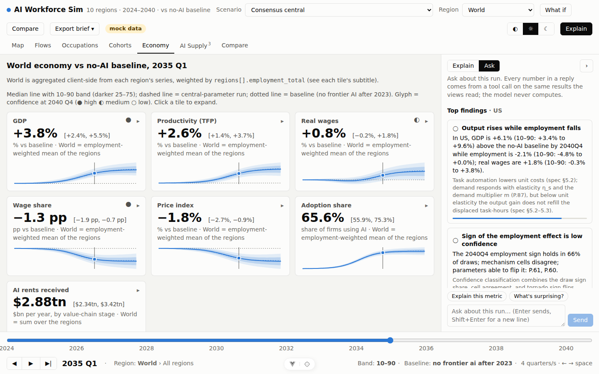

# AI Workforce Sim

An interactive, multi-region simulation of how AI models reshape the workforce and, through it, the economy, 2024–2040. The U.S., the EU, and Asia are first-class regions. Every parameter has a source, a central value, and a range; every output is a band relative to a world in which frontier AI froze in 2023, never a line.

**Status:** eight build phases complete; `main` carries the shipped model (specification v0.2 plus the **v0.3 amendment**, [docs/model-spec-v0.3-applications.md](docs/model-spec-v0.3-applications.md), which adds embodied automation, output substitution and traded-services channels, policy wiring, and a Seba/RethinkX preset). Phase 8 adds the **Story** view: one reconciled set of numbers, seven findings in plain language, named futures, policy runs, a personal outlook by occupation and age, an executive brief with charts, and a scoreboard that tests named forecasts (Seba/RethinkX 2017–2026, Acemoglu, Goldman, IMF) against the model on every run; see [docs/findings-phase8.md](docs/findings-phase8.md). Public demo: a static export served from GitHub Pages at `https://saro-saravanan.github.io/ai-workforce-sim/`; the workflow in `.github/workflows/pages.yml` builds it on every push to `main`.



## Quick start

```
make setup        # uv sync (Python 3.12 workspace) and pnpm install
make data         # fetch the pinned raw inputs (checksummed) and build the canonical tables with provenance
make run          # 200-draw, ten-region baseline → data/cache/baseline.json (~20 s on 4 cores)
make demo         # API on :8000 and the Vue app on :5173
make test         # simulation core, API, and web suites
```

`uv run aiwsim run --scenario scenarios/<id>.json` runs any scenario headless and prints the headline table. `make static` writes the serverless demo bundle to `web/public/static/`; `VITE_STATIC=1 pnpm build` in `web/` then builds the app against it.

Set `ANTHROPIC_API_KEY` in the API server's environment to enable the chat layer (`AIWSIM_CHAT_MODEL` overrides the default `claude-opus-5`). Without it, insights and briefs still work. Terminal: `cd api && uv run python -m aiwsim_api.chat "What if capability doubles every 4 months?" --hash sha256:…`.

## What it does

- **Task-level model.** ~19,000 O*NET tasks in 831 occupations, each with an ever-automatable mass, a feasibility point on a capability clock (METR task-horizon doublings), a modality, and a task-level profitability test against the worker's wage at the region's token price.
- **AI supply side.** 23 named actors across the U.S., EU, and Asia with release cadence, weights posture, prices, availability, and regional access lags; export-control and EU AI Act levers; a compute capacity constraint; rents by value-chain stage.
- **Adoption, labor flows, macro.** Bass diffusion by sector, firm size, and region, calibrated to BTOS; a hiring-first, layoffs-second labor market with cohorts that age; task-based output, prices, real wages, wage share, AI rents and net AI trade, transfers with financing rules.
- **Uncertainty as a first-class output.** 200 correlated draws re-centred on the scenario; a 2×2×2 structural ensemble over the mechanisms the literature disagrees on; one-at-a-time sensitivity; a confidence classification on every headline.
- **What-ifs as versioned JSON.** Levers, shocks, overrides, inheritance from a parent, canonical hashes; every run explains what changed, why, and how confident it is; paired comparisons on common draws.
- **Application layer (v0.3).** Every task group belongs to one channel: software, driving, mobile manipulation, fixed automation, aerial, or none. Embodied classes carry hardware unit cost on a learning curve, a production ramp, approval paths by region, and deployment coverage; ten catalogued applications (robotaxis to humanoids) report their gates. Self-employed and platform workers are in the headline.
- **Story and outlook (Phase 8).** A landing view that tells the run as seven findings with a chart, a likely range, a sureness label and "what changes it" for each; a jobs ledger and a people ledger kept apart and reconciled; named futures ("gains spent back", "gains pocketed", the Seba/RethinkX preset); policy runs (retraining, wage insurance, a basic income with an AI tax, a 36-hour week) read against the baseline with a fiscal-validity warning; "Your outlook" by occupation and age; an investment-versus-returns section that puts the hyperscalers' capex against what AI producers earn and what the economy gains; an executive brief with inline charts; and a scoreboard of named forecasts with a verdict on every run.
- **Nine views plus About**: story, your outlook, drillable world map, labor-flow Sankey, occupation heatmap, cohort view, economy dashboard, AI supply timeline, scenario compare. Light and dark, projector-legible.
- **A chat layer that never computes.** Claude turns a question into a scenario diff, runs only after confirmation, explains from the model's own channel decomposition and trace, and ranks findings from a deterministic candidate list; every number in a reply comes from a tool call into the simulation.

## Documents

| Document | What it is |
|---|---|
| [docs/methodology.md](docs/methodology.md) | The write-up: what the tool answers, the five layers, the three kinds of uncertainty, calibration, data and provenance, how to read a result, what it does not say |
| [docs/model-spec.md](docs/model-spec.md) | Specification v0.2: state variables, update rules, parameter registry, validation tests, limitations, change log, and §16 implementation notes where the code departs from the text |
| [docs/contracts.md](docs/contracts.md) | Contracts between packages: input tables, results document, API, CLI, web state, chat, insights, briefs, static export |
| [docs/data-inventory.md](docs/data-inventory.md) | Every dataset with source, license, coverage, access method, and gaps |
| [docs/risks.md](docs/risks.md) | Risks and assumptions ranked by how much they could change conclusions, with their status after the build |
| [docs/findings-phase1.md](docs/findings-phase1.md) … [phase8](docs/findings-phase8.md) | What the model said after each phase, what surprised us, what we do not trust yet |
| [docs/wireframes.md](docs/wireframes.md) | The wireframes the views were built from |
| [scenarios/](scenarios/) | `schema.json`, `baseline.json`, presets (Acemoglu 2024, Goldman Sachs 2023, IMF 2024), and the example what-if |

## Headline numbers (baseline, U.S., 2040 Q4, median and 10–90 band vs the frozen-AI counterfactual)

| Metric | Value | Sign confidence |
|---|---|---|
| Employment | −5.5% [−10.6, −0.4] (about 9.6 million jobs against the 174 million there would have been in 2040) | medium |
| GDP | +8.3% [+5.3, +16.1] | high |
| Real wages | +3.8% [+1.6, +7.2] | high |
| Wage share | −4.8 pp [−6.3, −3.3] | high |

In levels: about 152 million jobs today, 174 million by 2040 without further AI progress, 165 million with it (likely 156 to 174 million), so more jobs than today and fewer than there would have been. Most of the gap is hiring that never happens: about 8.1 million positions are never offered to new entrants against 3.0 million layoffs, and the layoff share is fitted to the AI-cited job cuts employers announced in 2025 and the first half of 2026 (Challenger, Gray & Christmas), which the spec's attrition-first rule had understated tenfold. The employment sign is only medium confidence because the demand multiplier can flip it ("gains spent back": +13%; "gains pocketed": −6%). Robots and vehicles reach 7% of task-hours by 2040 at central assumptions; under the Seba/RethinkX preset robotaxis pass 10% of driver work in 2030 and 75% by 2035, still below Seba's 95% claim because approval paths, the production ramp and the ever-automatable share bind before cost does. See `docs/findings-phase8.md`.

## Architecture

- `sim/` Python 3.12, numpy/polars, pure functions, deterministic given a seed, CLI-runnable, unit-tested (`aiwsim` package)
- `api/` FastAPI: scenarios, run, results, compare, explain, sensitivity, levers, regions, actors, chat, insights, brief, static export
- `web/` Vue 3 + TypeScript (Composition API, Vite, Pinia), D3 charts; no React
- `data/` canonical tables with a provenance record per dataset; ingestion scripts for every source, real where reachable, labelled fixtures otherwise
- Claude API for scenario parsing, explanation, and insights, through tool calls into the simulation only

## Data caveats

The build sandbox could reach only GitHub, so occupation tasks, exposure, employment, wages, and projections are real (Eloundou et al. replication data, OEWS 2021, BLS EP 2020–30, METR, Natural Earth) while occupation × state, occupation × sector, non-U.S. occupation structures, trade weights, and cohort joint distributions are labelled fixtures. Every results document says so in `meta.data_flags`, the map hatches fixture regions, and the ingest scripts in `sim/aiwsim/data/ingest/` replace the fixtures on a networked machine.

## Phases

1. U.S. only, static scenario, three core views, headless CLI runs
2. What-if levers, scenario compare, uncertainty bands
3. EU and Asia, AI supply-side actors, cross-region spillover
4. Chat interface, insight generation, shareable briefs
5. Polish, public demo, methodology write-up
6. v0.3: embodied automation (robotaxis, robots), self-employed and platform workers
7. v0.3: output substitution (AI-made content), traded services, full application catalogue
8. Story layer: one reconciled set of numbers, seven findings in plain language, named futures (including two Seba/RethinkX presets: the 2017 transport claims and the 2024–2026 humanoid and TaaS claims), policy runs, a personal outlook, an executive brief, and a scoreboard of named forecasts

Each phase ended with a "findings so far" note.
