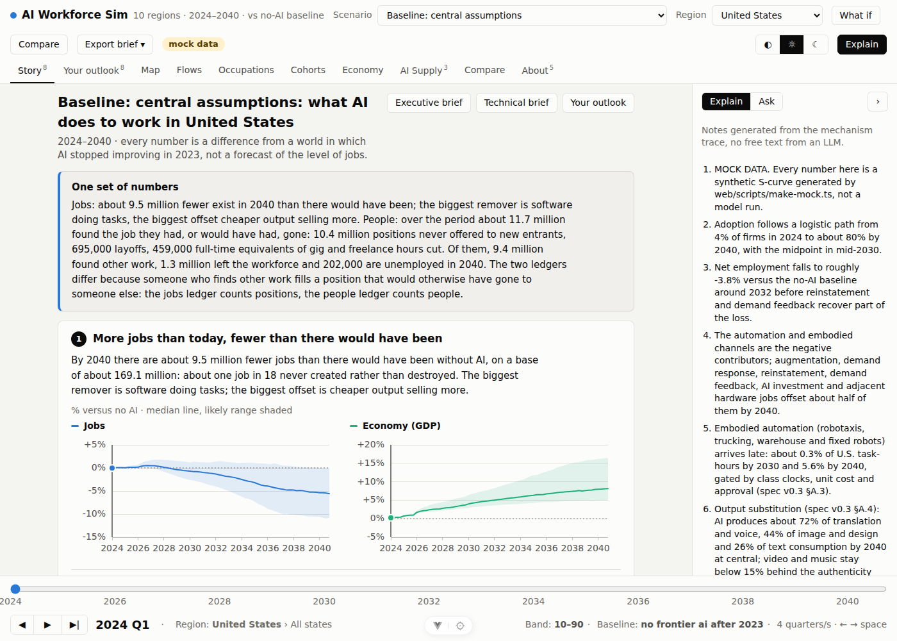
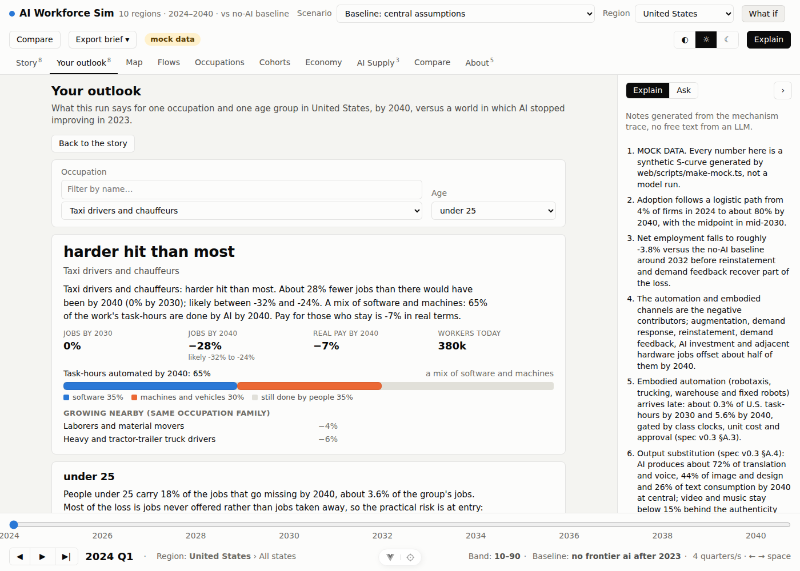

# Findings so far — Phase 8 (the story layer, policy wiring, the Seba/RethinkX preset)

Branch `spec/model-v0.3` at Phase 8. Baseline, U.S., 256 draws, 32 structural cells; companions (four policy runs and the Seba preset) at 64 draws, central run quoted. Everything is a difference from a world in which AI stopped improving in 2023.

## 1. One set of numbers

The reports of Phases 1–7 gave the same fact three ways (jobs below baseline, workers displaced, unemployed) and readers added them up. The story layer keeps two ledgers and explains why they differ:

- **Jobs ledger (positions), in levels.** About 152 million jobs today (the modelled occupations plus self-employed and platform workers). Without further AI progress, population and normal growth take that to about 174 million by 2040; with AI the median is about 164 million, likely 155 to 174 million. So: more jobs than today, and about 9.6 million fewer than there would have been, one job in eighteen. The biggest remover is software doing tasks (13.4 million by channel accounting); the biggest offset is cheaper output selling more (5.7 million).
- **People ledger (who was affected).** Over the period 11.7 million people found the job they had, or would have had, gone: 8.1 million positions never offered to new entrants, 3.0 million layoffs, 0.4 million full-time equivalents of gig and freelance hours cut. Of them 9.4 million found other work, 1.1 million left the workforce and 0.2 million are unemployed in 2040. Unemployment peaks at +458,000 in 2037.

The ledgers do not add up to each other because a person who finds other work fills a position someone else would have had. Saying so once, in the header of every story, removed the most common misreading of the earlier reports.

## 2. The seven findings and how sure the model is

| # | Finding | Sureness |
|---|---|---|
| 1 | More jobs than today, fewer than there would have been (9.5 million by 2040) | leaning this way |
| 2 | Most of the gap is hiring that never happens; about one position in four removed is a layoff (8.1 million unfilled entries vs 3.0 million layoffs, the layoff share fitted to announced AI-cited cuts) | leaning this way |
| 3 | The young pay first (under-25s carry 35% of the shortfall, 5% of their jobs; over-55s almost nothing; no degree loses three times a graduate) | leaning this way |
| 4 | Pay up 4%, the economy up 8%, the workers' share of income down 4.8 points | we would bet on it |
| 5 | Three waves: office work now (graphic designers −17% by 2030), robots and vehicles later (0.2% of task-hours in 2030, 6.9% in 2040), AI-made content category by category (translation and voice 72% of spending by 2040, video 8%) | leaning this way |
| 6 | The money flows to the U.S. and the chip makers ($151 billion a year of AI income to the U.S., $50 billion to China; largest GDP gains in Taiwan and Korea) | leaning this way |
| 7 | Two futures, and the difference is partly a choice: gains spent back (+13%, 22 million more jobs) or pocketed (−6%) | a coin flip |

### 2c. Reality check: the 2025–2026 layoffs

The first version of this note said "people are not fired, they are not hired" and put layoffs at 0.7 million by 2040. That reading came from the spec's attrition-first rule, under which employers wait for people to leave. It contradicted what employers were doing: Challenger, Gray & Christmas counted 54,836 AI-cited job cuts announced in 2025 and 173,568 since 2023 by June 2026, when AI led all stated reasons for cuts five months running. The model's central run had 12,000 layoffs by the end of 2025.

Phase 8 therefore adds a lever, the share of each required cut that employers take as layoffs before attrition, and fits it to the announced counts: at 0.25 the central run gives 67,668 layoffs in 2025 and 143,034 since 2023 by June 2026, within a factor of 1.3 of both. Two scoreboard rows carry the counts on every run. The consequences for the story: layoffs are 3.0 million by 2040 rather than 0.7 million, about one position in four removed; the unemployment peak barely moves (most of the laid-off are re-employed); the total gap does not move at all; and the sureness of finding 2 drops from "we would bet on it" to "leaning this way", because the layoff share is now a fitted number resting on one private tally of stated reasons. Announced cuts include positions closed by attrition and redeployment, so the fit is deliberately loose (risk #38). A variant scenario doubles the share: 3.8 million layoffs by 2040, unemployment peaking 563,000 above the no-AI path, the same total.

The first finding was also retitled. "More jobs than today" cannot be read off a chart of percentages against the no-AI path, so the beat now carries levels: today, 2040 without AI, and 2040 with AI with its range. The claim survives in the baseline (the median is 8% above today, the low end 2% above), and the beat's title is computed from the levels, so a scenario in which 2040 employment falls below today would say so.

Sureness is the existing confidence classification renamed for readers: high → "we would bet on it", medium → "leaning this way", low → "a coin flip". No finding was reworded to sound surer than its classification.

## 3. Tony Seba as a predictor: what the model can and cannot reproduce

The Seba/RethinkX preset transcribes his framework into levers rather than asserting his numbers: electronics-like learning rate (0.25), fleets built at the fastest historical ramp (1.5/yr), 1.5× utilization (transport as a service), unit price 0.7×, embodiment clocks doubling every 8–12 months and coupled to the software frontier, accelerated approvals where fleets already operate, eroding preference for human-made content.

- **Robotaxis.** Under the preset robotaxis pass 10% of taxi and ride-hail driver work in 2030Q4 and reach 76% by 2035, then stop: approval paths cap coverage at 85% and the ever-automatable share of the role at 85%. The baseline reaches 10% only in 2037. Trucking and last-mile delivery follow the same shape (83% by 2035 under the preset).
- **What made this possible.** Task-level substitution had left 69% of a taxi driver's job in place with a vehicle that carries the passenger, because the task engine discounts tasks that need a person present. Phase 8 introduces a whole-job rule for driving roles: the presence discount is lifted for their driving tasks and realized displacement is scaled by the inverse driving weight, so a fully covered fleet removes the role. `meta.whole_job` reports the numbers behind the rule for each role.
- **Scoreboard verdicts.** Against Seba's 2017 claim of 95% of passenger miles autonomous by 2030 the model reads 12% coverage in 2030 under his own assumptions ("model lower"); against 90% driver displacement, 11% in 2030 and 76% by 2035. Against RethinkX 2020's 20% of physical work disrupted by 2030, the model reads 8.9% of task-hours by 2035. The model agrees with the *shape* (an S-curve that goes from 1% to 75% in seven years) and disagrees on the *date* by about five years, and the disagreement is not about cost: at half the unit price the curve does not move. It is about approvals, the production ramp, and the multi-region fleet allocation (U.S.-only runs reach 73% by 2030; the global ramp shared across ten regions delays the U.S. curve).
- **Whole economy.** The preset moves 2040 employment from −5.6% to −7.2% (central) and GDP from +8.1% to +10.0%. Robots and vehicles do 8.9% of task-hours by 2035 against 6.9% by 2040 in the baseline.

The preset is labelled as levers, and the 2017 and 2020 forecast rows are transcribed from recollection (`source_tag` V?) until the reports are fetched and cited (`docs/data-inventory.md`).

### 3b. Seba's 2024–2026 claims: humanoids and transport-as-a-service

RethinkX's current labour work (*Near-zero cost labor*, 2025; *This time, we are the horses*, updated December 2025; *The Painful Truth about AI & Robotics*, 2026) and the 2026 *Rethinking Energy, Mobility, and Materials* roadmap make bigger claims than the 2017 transport report: humanoid labour under $10/hour at entry and under $1/hour before 2035, robots doing as much work as people by the late 2030s, and TaaS carrying over 80% of urban passenger miles by about 2035. A second preset, `preset-seba-2026`, pushes the manipulation class as hard as the first pushes driving (every clock at six months, the ever-automatable share of manipulation at the top of its range, utilization ×1.6, unit price ×0.5, accelerated approval everywhere, induced demand ×2), and five scoreboard rows test the claims. Companions at 64 draws, central run:

| Claim | Baseline | Seba 2017 preset | Seba 2026 preset |
|---|---|---|---|
| Humanoid labour under $10/hour at entry (2025) | $4.27, model lower | $1.38 | $0.92 |
| Under $1/hour before 2035 (2034) | $2.03, within band | $0.06 | $0.04 |
| Robots do half of physical work by 2039 | 9%, model lower | 38%, model lower | 48%, model lower (by 1.5 points) |
| TaaS 50% of urban passenger miles by 2032 (robotaxi coverage) | 3%, model lower | 71%, within band | 71%, within band |
| TaaS over 80% by 2035 | 8%, model lower | 85%, within band | 85%, within band |

Three readings.

- **Cost is not where the model disagrees with him.** The model's hardware cost per worker-hour for manipulation (annualized unit price over utilized hours, integration excluded) is below RethinkX's entry figure even in the baseline, and under either preset it falls to a few cents by the mid-2030s. What holds embodied displacement to 11% of all task-hours under the 2026 preset is the production ramp, approval, and the ceiling on how much of physical work can ever be automated, not the price of the robot.
- **"As much labour as humans" is a claim about physical work.** Embodied channels are 24% of all task-hours in the model's task partition; office and analytical work is the software channel. Measured against physical task-hours, the 2026 preset reaches 48% by 2039 against the claim of 50%, so the model can essentially reproduce his humanoid claim when every constraint is set to its most favourable value. It cannot reproduce it at central assumptions (9%), and the difference is the ramp cap (1.5/yr against 0.5/yr) and the ever-automatable share (0.85 against 0.6) more than anything else.
- **TaaS by 2035 is within reach of the model under his assumptions but capped by approval.** Robotaxi coverage saturates at 85% because the accelerated approval path stops there; the 2032 and 2035 TaaS rows read within band under either preset, and the 2017 "95% by 2030" row still reads model lower because the fleet does not exist in 2030 (coverage 12%) whatever the cost.

The 2026 preset costs 2.8 points of 2040 employment against the baseline (−8.4% against −5.6%) and adds 2.8 points of GDP (+10.9%). The two Seba presets are both named futures in the story. The forecast rows for the labour series come from page summaries and the user-supplied summary of the 2026 report; `source_tag` says so on each row, and `docs/data-inventory.md` lists what to fetch to confirm them.

### 2b. Where the AI income comes from

The money beat used to say who receives AI income (the U.S. $151 billion a year by 2040, China $50 billion, the EU $35 billion, Taiwan $26 billion) without saying who pays. The results document now carries the sources (`ai_spend_by_source_bn`, `ai_spend_by_occupation_group_bn`) and the story beat reads them:

- **Who pays.** Of the $282 billion spent on AI worldwide in 2040, 84% is employers replacing tasks with software, 11% is employers buying tools that speed up workers, and 6% is consumers paying for AI-made content. Robot and vehicle hardware is a separate flow (`hardware_capex_bn`), counted as production in the making region rather than as AI income.
- **Whose work is bought.** The software spend is paid for work in management ($42 billion), business and financial operations ($34 billion), office and administrative support ($33 billion), computer and mathematical work ($27 billion), sales ($19 billion) and healthcare practice ($16 billion). This is the displaced task-hours of each occupation group priced at the tokens they cost, so it is the labour-displacement side of the same ledger as the jobs beats.
- **Where it lands.** For the U.S., the receipts split into cloud and data-centre operators ($54 billion), model makers ($47 billion), chip makers ($38 billion) and local integrators and platforms ($13 billion).

The sector table is still a single-sector fixture, so the breakdown is by occupation group rather than by industry; an industry split arrives with the occupation-by-sector ingest (`docs/data-inventory.md`).

## 4. What could be done: the policy runs

| Policy | Jobs vs baseline, 2040 | Unemployed | Pay per head | Cost | Validity |
|---|---|---|---|---|---|
| Retraining subsidy, 50% of wage | no measurable change | −37,000 | — | $5 bn/yr, deficit | ok |
| Wage insurance, 50% for two years | no measurable change | — | — | $3 bn/yr, AI tax | ok |
| $500/month basic income, 30% AI tax | +13.8 million | +70,000 | — | $1,742 bn/yr, of which $1,721 bn deficit (5% of GDP) | **outside the model's range** |
| 36-hour standard week | +17.9 million heads | — | −10.5 points | none | ok, but heads not hours |

Two lessons. Targeted labour-market policies barely move the headline because the headline is set by labour demand, not by frictions; they move who bears it. Large transfers move the headline a lot in a model with no inflation, interest-rate or debt response, and the run says so in every sentence it applies to. The work-week result is arithmetic: the same hours over more heads.

## 4b. Investment versus returns: how $700 billion a year of capex squares with the revenue AI earns

The four largest cloud companies spent about $413 billion on data centres, chips and power in 2025 and have guided to about $725 billion for 2026. The model takes that path as an input (P.80–P.82: $720 billion in 2026, rising 10% a year to about $1.05 trillion in 2029 and flat after, $15.6 trillion over 2024–2040) and uses it for compute capacity and for the construction and operations jobs of the investment channel. It never asks whether the capital earns a return. Phase 8 adds a section that puts three quantities side by side on every run, and, in doing so, exposed a hole in the model's revenue accounting.

**The hole.** The first version priced AI at token cost for the hours it displaced or sped up, and reported $15 billion of world AI revenue in 2026 against an industry whose two leading labs alone were booking $85 billion a year by mid-2026. Consumer subscriptions, advertising, pilots, seats and agentic usage that displaces nothing yet, frontier pricing and provider margins were all outside the accounting. The labour engine was not wrong about jobs, but a model of AI's economic footprint that misses most of AI's revenue cannot speak to the investment question. The fix is a revenue layer (spec A.16): employers pay a market price for AI work, cost times a multiple that starts at 5 in 2025 (usage intensity per unit of work delivered about 2×, frontier pricing about 2×, margin about 1.3×) and compresses with a five-year half-life to 1.5; consumers' AI spending follows its own path from $15 billion in 2025 toward $150 billion; and both are fitted to the industry's reported 2025 revenue and 2026 run rates, which now sit on the scoreboard with their ranges. The multiple also enters firms' cost test, so their savings are smaller and early displacement is a little slower (the median 2040 employment effect moves from −5.6% to −5.5%).

| Year | Capex ($bn) | AI producers' revenue ($bn) | of which consumers | Productivity gain ($bn) |
|---|---|---|---|---|
| 2025 | 413 (reported) | 53 | 20 | 43 |
| 2026 | 732 (guidance) | 92 | 29 | 115 |
| 2030 | 1,054 (model path) | 476 | 87 | 1,230 |
| 2040 | 1,054 (model path) | 608 | 149 | 3,890 |

Three readings, in the order the section gives them.

- **Producers earn a fraction of the capital, but a growing one.** Cumulative producers' revenue is about $7.4 trillion over 2024–2040, 48% of the capital spent, and it does not catch up with cumulative capex by 2040. Revenue grows from $53 billion in 2025 to about $600 billion a year by 2040 as adoption spreads, pricing compresses and consumer spending saturates. On the two calibration rows the model reads within band.
- **The economy earns the return, and early.** Productivity gains reach $1.2 trillion a year by 2030 and $3.9 trillion by 2040 across the modelled regions, $32 trillion cumulative, 2.1 times the capital; on productivity alone the capex is repaid by 2033. Counting the data-centre build itself as output, the GDP effect is about $780 billion already in 2026, most of it the construction. That gain lands with the firms that adopt AI and, through lower prices, with their customers, not with the builders.
- **What closes the gap.** The build-out is a bet that revenue grows into capacity; the capex path is front-loaded and revenue follows adoption, so on a revenue-to-capex basis the early years look like a bubble by construction. Either pricing holds well above cost for longer than the model's half-life, adoption runs faster than the central pace (the Seba presets), or investors accept a railway-style outcome in which society earns most of the return. The model cannot say which; risk #39 records that it has no channel through which a poor return cuts the build-out, and risk #40 that the revenue layer is fitted, not derived.

What "AI income" or "AI rents" means in these documents: the revenue of AI producers by value-chain stage (models, cloud and data centres, chips, integration): employers' spending on AI at market prices, consumers' spending on AI subscriptions and services, and payments for AI-made content, split across the stages and allocated to the regions whose companies hold the market share. It is gross revenue, not profit and not economic rent in the textbook sense; the story calls it "AI producers' revenue" and the glossary says so.

## 5. Your outlook

`GET /api/outlook/{hash}?occ=&age=` gives one occupation and one age band a verdict (rank among all occupations), the 2030 and 2040 numbers with their range, whether the automated task-hours are software or machines, pay for those who stay, and nearby occupations that grow. Taxi drivers under the baseline: among the hardest hit, 32% fewer jobs by 2040 (1% by 2030), mostly machines and vehicles. Customer service representatives: about average, 8% fewer, mostly software. Static mode computes this client-side from the run document with the same rules.

## 6. What I do not trust yet

- The whole-job rule assumes the non-driving tasks (loading, assisting passengers, paperwork) vanish with the role. Risk #37.
- The policy wiring is a first pass (risk #36); the UBI result is a demonstration of the validity flag, not a finding.
- The "gains spent back" future is the tornado extreme of one parameter (P.87) and reads as a very rosy world; it is the upper edge of the model's range, not a scenario anyone has argued for.
- Regional job numbers outside the U.S. still rest on placeholder occupation mixes, so "largest job losses in the UK and EU" is a structure statement, not a measurement.
- Eight of twelve scoreboard rows compare a claim with the nearest model quantity (`proxy = 1`), and their verdicts are about direction and size. For the two cost rows, "model lower" means the model is the more aggressive of the two.
- The manipulation cost per hour is hardware only; integration (P.09) and the human-presence discount are applied inside the profitability test, so the scoreboard's cost figure understates what an employer pays.

## 7. Runtime and verification

Baseline 57 s at 256 draws (Monte Carlo 33 s, tornado 12 s, channels 6 s); companions about 45 s each at 64 draws on first use, cached by hash after. Tests: `sim/tests/test_phase8.py` (policy off in baseline, work week converts hours to heads, UBI trips the fiscal flag, retraining raises retraining and lowers unemployment, whole-job rule tracks coverage, induced demand softens embodied job loss, scoreboard verdicts and preset movement), `api/tests/test_story.py` (beats, reconciled numbers, companions, outlook, executive brief formats and endpoints), plus the Phase 6–7 application tests.
